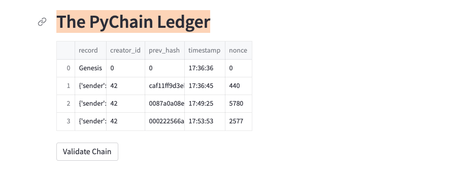

# Week-18-Blockchain-creation

Blockchain technology has taken the world by a storm. With the advent of Blockchain in 2008, it has been shown its applicability to different sectors like art, media, banking and finance, insurance, media & entretainment, telecommunication, etc. Concepts and applications like bitcoin, NFTs(Non Fungible Tokens), DeFi(Decentralized Finance),etc are

The central idea of blockchain revolves around a decentralized and immutable data structure over a network in the form of a ledger. Blockchin uses , what it calls as a block, to store the information, data, transaction. A block has to be validated within the concensus of the stakeholders of the blockchain system. A block's information is stored and thena is validated by a process called hashaing, which allots a complex mathematical number to the transaction for the data entry to be validated.  

Blockchin is built upon concepts of decentralization, distributed architectural structure that enables multiple nodes with least restrictions, to create an evironement of trust, transparency, and efficiency. 

## The program

The program is a simple blockchain based application that records the ledger records of amount of funds being sent, sender, adn reciever. It uses a front-end platform to interaction with the user to enter the transaction data. Then it creates and allots a hash number to the transaction, and also validates the transaction by verifying its previous hash number. Thus, it helps create a block chain database named 'The PyChain Ledger'.

## Technology
The technology involved in making the application include python and its libraries for coding, VS Code as writing tool, and streamlit for user interaction.

## Installation

The following need to be installed and imported for the applicataion:

* installation and import of Streamlit
    for installation: !pip install streamlit (on Terminal)
    import streamlit as st
* import of dataclasses
    from dataclasses import dataclass
* import of datetime
    import datetime as datetime/Users/babinshrestha/Desktop/workspace/week 18/Starter_Code 3/pychain.py
* import of pandas 
    import pandas as pd
* import of hashlib
    import hashlib

## the program

We establish the dataclass for the variables we will be using in the program

We define a function that will create hash(number)

We define a function to create proof of work to validate the hash by checking with the previous hash. Hash is one of the elements that is very crutial in the process of creating the chain for the blocks.

Codes contolling the interactaive data entry.

The program can be run via the command in terminal, in the same directory where the program is stored

<u> streamlit run pychain.py</u>

## results

The command is executed in Terminal, Terminal opens streamlit webpage on a browser.

There are options to enter the data, generate the hash, and validate the block.

Enter input(sender, reciever, amount) and validate data

We can control the diffculty level, or the number of zeros before the hash. The greater the number of zeros, the harder it is to match.

The ledger that was generated.

There is also option to inspect particular block transactions.

